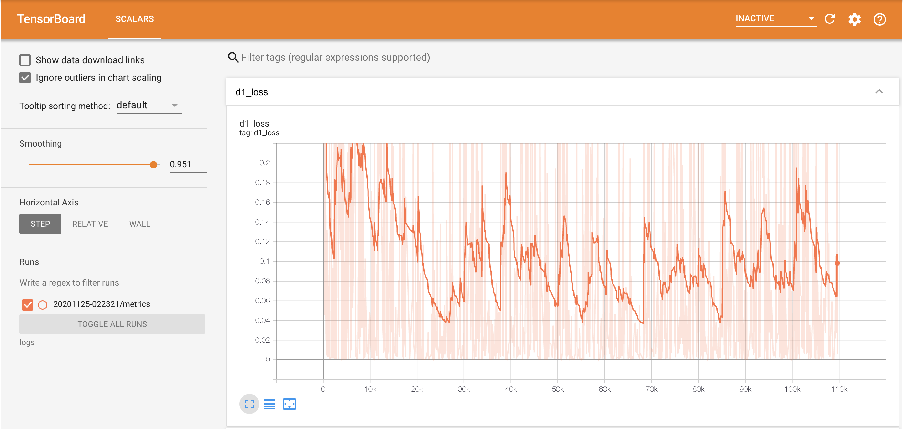
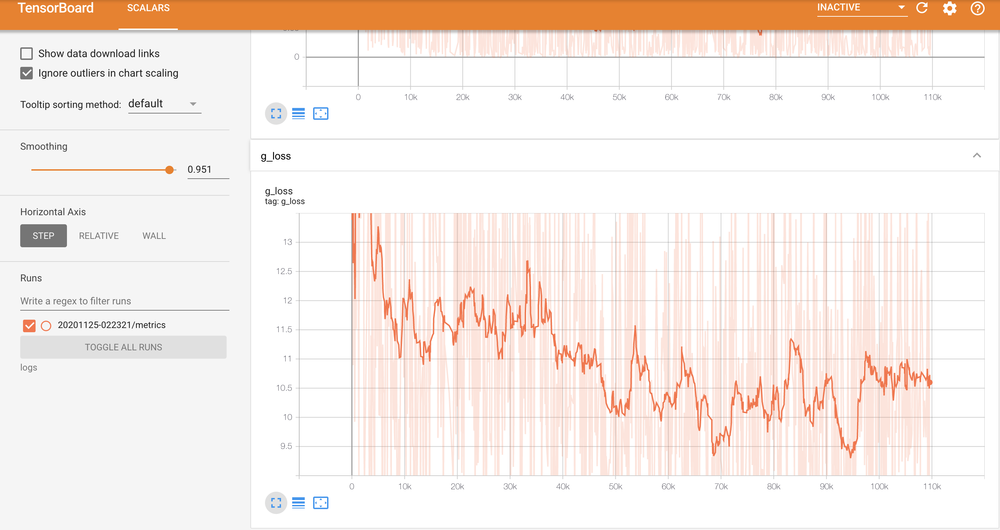
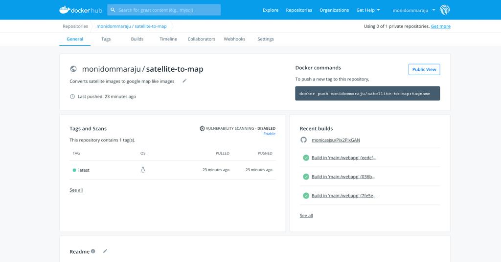

# Image to Image Translation using GAN

In this project we put our best effort to train Pix2PixGAN and CycleGAN models for Image to Image Translation on Maps Dataset for converting Google map images to satellite images.

Presentation (https://docs.google.com/presentation/d/1kKq7RYwMjsFhKzZYD3WSrkTUEyX7VZf5/edit#slide=id.p12)

## Approach
1. Image to Image Translation done for this project by using two approaches
    1. Using Pix2PixGAN 
    2. Using CycleGAN

## Dataset
1. We have collected images of maps which contains satellite images of New York region 
2. The collected images contains pairs of satellite images corresponding with Google map images
3. The dataset consists of 1096 train images and 1097 test images which are in JPEG format.

Dataset is available in our drive: https://drive.google.com/drive/u/2/folders/1Z0YRs4SstJF9uI81IYzQBQZHHL8LiZJf

In Image to Image translation it tries to do mapping between the source and the target images. We have performed it using Pix2Pix and CycleGAN.

## Pix2PixGAN
 1. Pix2Pix Generative Adversarial Networks is used to train a deep convolutional network for image to image translation on maps dataset.
 2. The GAN architecture consists of a discriminator and a generator model. Discriminator model is a CNN that performs conditional image classification by classifing the image as real or fake. Batch Normalization is used in this model and generally used in all of the deep convolutional discriminator models.
 3. The Discriminator model is updated directly and the Generator is an encoder-decoder model which uses a U-Net architecture. The model takes a source image (e.g. satellite photo) and generates a target image (e.g. Google maps image).
 4. The generator and discriminator are trained simultaneously where generator tries to fool the discriminator model by producing exemplary outputs that look just like the real images(datasets).

Training: 
 1. Implemented pix2pix using keras 
 2. Performed training by implenting the generator,the discriminator model and the composite model(takes the generator and the disrminator model as input).
 3. Epochs has been set to 100 and the batch size is given as 1.
 4. With the 1097 training images and batch size of 1, each iteration is done by doing 1097 training steps. So, for the whole 100 epochs model will run for 109,700 training steps.
 5. The models are saved after every 2000 steps and the best model is choosen from them by evaluating them manually. It is later used for testing.
 6. All the models are saved in the drive: https://drive.google.com/drive/u/2/folders/1-5ZkkbtW6hc2eFTEwb2TGlrrAiI7jps-
 7. Tensorboard setup has been done to visualize the losses.
 8. Few experiments have also been done by hyperparameter tuning.
 

## CycleGAN
 1. Cycle Generative Adversarial Networks is similar to pix2pix except that it uses two discriminators and two generator models.
 2. The model architecture is comprised of two generator models: one generator (Generator-A) for generating images for the first domain (Domain-A) and the second generator (Generator-B) for generating images for the second domain (Domain-B).
	Generator-A -> Domain-A
	Generator-B -> Domain-B
 3. It uses Instance Normalization instead of Batch Normalization which is generally used in deep convolutional discriminator models.

Training:
 1. Implemented the cycleGAN using Keras.
 2. The train function uses two discriminators, two generators and two composite models as arguments.
 3. The batch size is 1 and the maps dataset consits of 1097 images and one epoch is defined as 1096 images and totally 109,700 training steps. 
 4. The models ares saved in the drive along with the plots of generated images. https://drive.google.com/drive/u/2/folders/11KTSDpHciZCnGO1WNP1rUEBzLSRQaKtF

## Deployement:
 1. The model has been deployed onto Amazon EC2.
 
  
 2. The best model of pix2pix and cycleGAN's are saved onto S3.
 
 

 3. Using git and Docker Hub for deployement pipeline.
 
 
